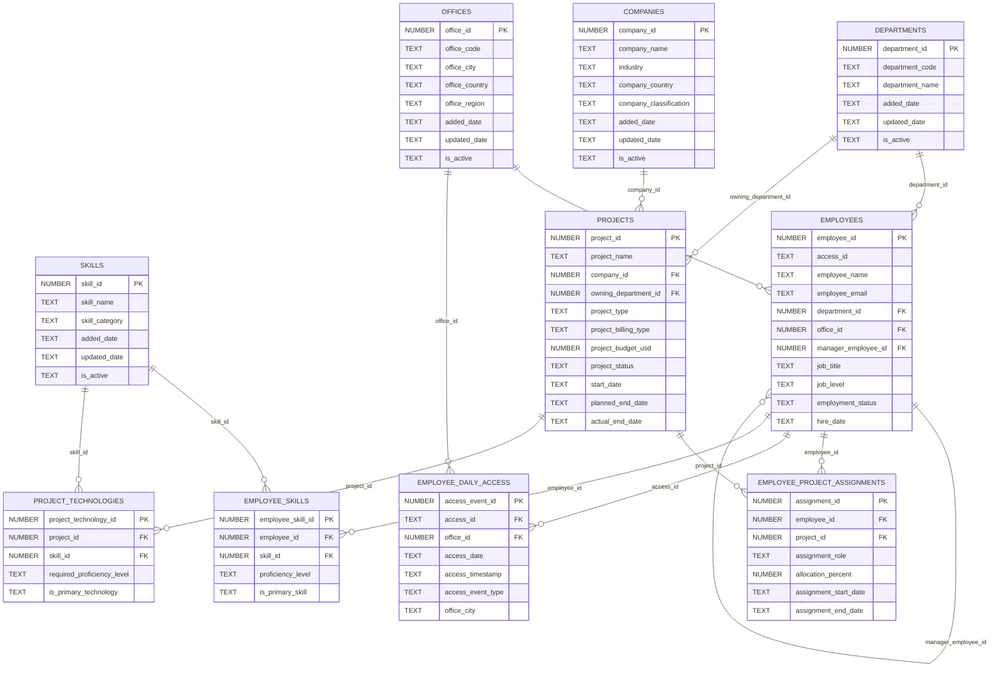

# HR Analytics: Legacy Snowflake Pipeline (Stored Procedures, Streams & Tasks)

## Overview

This directory contains a **single consolidated SQL deployment** of the HR Analytics medallion pipeline on Snowflake. The pipeline uses stored procedures, streams, tasks, and an internal stage (no S3 dependency) to process synthetic HR data through Bronze, Silver, and Gold layers, culminating in a Cortex Analyst semantic view.

This is the **legacy pipeline** that serves as the baseline for migration to a modern dbt project.

---

## Files in this Directory

| File | Purpose |
|:---|:---|
| `hr_analytics_deploy.sql` | Full deployment script (~3,800 lines). Creates all database objects in dependency order. |
| `put_full_load.sql` | PUT base-load CSVs to internal stage, COPY into Bronze, run Silver + Gold pipelines. |
| `put_delta_load.sql` | PUT daily-delta CSVs (day_01 through day_05) to stage, run batch loader per day. |
| `tear-down.sql` | Suspends tasks, drops the `HR_ANALYTICS` database and all child objects. |

---

## How to Set Up the Legacy Pipeline

### Prerequisites

- A Snowflake account with `ACCOUNTADMIN` role access.
- The `snow` CLI installed and a connection configured in `~/.snowflake/connections.toml` (e.g. `dbt-account`).
- Python 3 with the `snowflake-connector-python` package (required for PUT file uploads).
- The synthetic CSV data files located at `synthetic-data/data/` (full load) and `synthetic-data/daily-delta/` (incremental).

### Step 1: Deploy All Objects

Run the consolidated deployment script. This creates the database, schemas, tables, streams, procedures, tasks, file format, internal stage, semantic view, governance tags, and data metric functions.

```bash
# Using snow CLI (executes each statement sequentially)
snow sql -f single-sql-script/hr_analytics_deploy.sql -c dbt-account
```

> **Note:** The deployment script uses `CREATE ... IF NOT EXISTS` and `CREATE OR REPLACE` so it is idempotent and safe to re-run.

### Step 2: Upload Base-Load CSV Files to Internal Stage

PUT commands require a client-side driver (they cannot run from Snowflake worksheets or the SQL API). Use the Python connector:

```python
import snowflake.connector

conn = snowflake.connector.connect(
    account='<YOUR_ACCOUNT>',
    user='<YOUR_USER>',
    password='<YOUR_PASSWORD>',
    role='ACCOUNTADMIN',
    warehouse='COMPUTE_WH',
    database='HR_ANALYTICS',
    schema='UTIL'
)
cur = conn.cursor()

base = 'synthetic-data/data'
files = [
    '01_departments_master.csv',
    '02_offices_master.csv',
    '03_companies_master.csv',
    '04_employees_master.csv',
    '05_projects_master.csv',
    '06_employee_project_assignments.csv',
    '07_employee_daily_access.csv',
    '08_skills_master.csv',
    '09_employee_skills.csv',
    '10_project_technologies.csv',
]

for f in files:
    cur.execute(f"PUT file://{base}/{f} @HR_ANALYTICS.UTIL.CSV_STAGE/full-load/ AUTO_COMPRESS=FALSE OVERWRITE=TRUE")
    for row in cur:
        print(row)

cur.close()
conn.close()
```

### Step 3: COPY Data into Bronze and Run the Pipeline

```sql
-- Run from Snowflake worksheet or snow CLI
USE ROLE ACCOUNTADMIN;
USE DATABASE HR_ANALYTICS;
USE SCHEMA BRONZE;

-- COPY all 10 base-load files into Bronze
COPY INTO DEPARTMENTS (department_id, department_code, department_name, added_date, updated_date, is_active, __STG_FILE_NAME, __STG_FILE_ROW_NUMBER, __STG_LOAD_TS)
FROM (SELECT $1,$2,$3,$4,$5,$6, METADATA$FILENAME, METADATA$FILE_ROW_NUMBER, METADATA$START_SCAN_TIME FROM @HR_ANALYTICS.UTIL.CSV_STAGE/full-load/)
PATTERN = '.*01_departments_master\.csv(\.gz)?'
FILE_FORMAT = (FORMAT_NAME = 'HR_ANALYTICS.UTIL.CSV_FF');

-- (Repeat for all 10 entities - see put_full_load.sql for the full list)

-- Run Silver pipeline (all 10 stream-consuming loaders)
CALL HR_ANALYTICS.UTIL.SP_RUN_ALL_SILVER_LOADS();

-- Run Gold pipeline (8 dimensions + 5 facts/bridges)
CALL HR_ANALYTICS.UTIL.SP_RUN_ALL_GOLD_LOADS();
```

### Step 4: Verify Data (Optional - Load Daily Deltas)

```sql
-- Upload delta files for day_01, then run the batch loader
-- (use Python PUT for file upload, then:)
CALL HR_ANALYTICS.UTIL.SP_APPLY_DAILY_DELTA_BATCH('day_01');
CALL HR_ANALYTICS.UTIL.SP_APPLY_DAILY_DELTA_BATCH('day_02');
-- ... repeat for day_03 through day_05
```

### Step 5: Tear Down (When Done)

```sql
-- tear-down.sql: suspends tasks and drops the entire database
ALTER TASK IF EXISTS HR_ANALYTICS.UTIL.TASK_SILVER_TO_GOLD SUSPEND;
ALTER TASK IF EXISTS HR_ANALYTICS.UTIL.TASK_BRONZE_TO_SILVER SUSPEND;
DROP DATABASE IF EXISTS HR_ANALYTICS;
```

---

## Medallion Architecture Diagram

The pipeline follows the **Medallion Architecture** pattern with Bronze (raw), Silver (cleansed), and Gold (business-ready) layers:

```mermaid
flowchart LR
    subgraph SOURCE["Source Files"]
        CSV["CSV Files<br/>(Internal Stage)"]
    end

    subgraph BRONZE["Bronze Layer<br/>(Raw, Append-Only)"]
        B_DEPT["DEPARTMENTS"]
        B_OFF["OFFICES"]
        B_COMP["COMPANIES"]
        B_EMP["EMPLOYEES"]
        B_PROJ["PROJECTS"]
        B_ASSIGN["EMPLOYEE_PROJECT<br/>_ASSIGNMENTS"]
        B_ACCESS["EMPLOYEE_DAILY<br/>_ACCESS"]
        B_SKILL["SKILLS"]
        B_ESKILL["EMPLOYEE_SKILLS"]
        B_PTECH["PROJECT_TECHNOLOGIES"]
    end

    subgraph STREAMS["Append-Only Streams"]
        S1["10 STREAMS<br/>(CDC feed)"]
    end

    subgraph SILVER["Silver Layer<br/>(Typed, Validated, Enriched)"]
        SV_TABLES["10 Silver Tables<br/>+ Quarantine Log"]
    end

    subgraph GOLD["Gold Layer<br/>(Star Schema)"]
        DIMS["9 Dimensions"]
        FACTS["3 Fact Tables"]
        BRIDGES["2 Bridge Tables"]
    end

    subgraph SEMANTIC["Semantic Layer"]
        SEM["HR_ANALYTICS_MODEL<br/>(Cortex Analyst)"]
    end

    CSV -- "COPY INTO" --> BRONZE
    BRONZE --> S1
    S1 -- "SP_RUN_ALL_SILVER_LOADS<br/>(10 Stored Procedures)" --> SILVER
    SILVER -- "SP_RUN_ALL_GOLD_LOADS<br/>(15 Stored Procedures)" --> GOLD
    GOLD --> SEM

    style SOURCE fill:#e8f4fd,stroke:#1a73e8
    style BRONZE fill:#fff3e0,stroke:#e65100
    style STREAMS fill:#fce4ec,stroke:#c62828
    style SILVER fill:#e8f5e9,stroke:#2e7d32
    style GOLD fill:#fff8e1,stroke:#f9a825
    style SEMANTIC fill:#f3e5f5,stroke:#7b1fa2
```



### Task Orchestration

```
TASK_BRONZE_TO_SILVER (root, 60 min schedule)
    WHEN: any of the 10 Bronze streams has data
    AS:   CALL SP_RUN_ALL_SILVER_LOADS()
        |
        v
TASK_SILVER_TO_GOLD (child, runs after parent completes)
    AS:   CALL SP_RUN_ALL_GOLD_LOADS()
```

---

## Bronze Layer ER Diagram

The Bronze layer contains 10 raw landing tables. All columns are raw VARCHAR/NUMBER types (no transformations). Foreign key relationships are logical (not enforced at this layer).



---

## Gold Layer ER Diagram (Star Schema)

The Gold layer implements a dimensional model with SCD Type-2 dimensions, effective-dated facts, and factless bridges. All joins use SHA2-256 hash keys (`_HK` suffix).

```mermaid
erDiagram
    DIM_DEPARTMENT {
        VARCHAR department_hk PK
        NUMBER department_id
        VARCHAR department_code
        VARCHAR department_name
        BOOLEAN is_active
        DATE __effective_from_date
        DATE __effective_to_date
        BOOLEAN __is_current
    }

    DIM_OFFICE {
        VARCHAR office_hk PK
        NUMBER office_id
        VARCHAR office_code
        VARCHAR office_city
        VARCHAR office_country
        VARCHAR office_region
        BOOLEAN is_active
    }

    DIM_COMPANY {
        VARCHAR company_hk PK
        NUMBER company_id
        VARCHAR company_name
        VARCHAR industry
        VARCHAR company_country
        VARCHAR company_classification
        BOOLEAN is_active
    }

    DIM_EMPLOYEE {
        VARCHAR employee_hk PK
        NUMBER employee_id
        VARCHAR employee_name
        VARCHAR employee_email
        VARCHAR department_hk FK
        VARCHAR office_hk FK
        VARCHAR manager_employee_hk FK
        VARCHAR job_title
        VARCHAR job_level
        VARCHAR employment_status
        DATE hire_date
    }

    DIM_PROJECT {
        VARCHAR project_hk PK
        NUMBER project_id
        VARCHAR project_name
        VARCHAR company_hk FK
        VARCHAR owning_department_hk FK
        VARCHAR project_type
        VARCHAR project_billing_type
        NUMBER project_budget_usd
        VARCHAR project_status
        DATE start_date
        DATE planned_end_date
        DATE actual_end_date
    }

    DIM_SKILL {
        VARCHAR skill_hk PK
        NUMBER skill_id
        VARCHAR skill_name
        VARCHAR skill_category
    }

    DIM_PROFICIENCY {
        VARCHAR proficiency_hk PK
        VARCHAR proficiency_level
        NUMBER proficiency_rank
    }

    DIM_ASSIGNMENT_ROLE {
        VARCHAR assignment_role_hk PK
        VARCHAR assignment_role
    }

    DIM_DATE {
        VARCHAR date_hk PK
        DATE date_day
        NUMBER day_of_week
        VARCHAR day_name
        NUMBER month_num
        VARCHAR month_name
        NUMBER quarter_num
        NUMBER year_num
        BOOLEAN is_business_day
    }

    FACT_EMPLOYEE_DAILY_ACCESS {
        VARCHAR access_event_hk PK
        NUMBER access_event_id
        VARCHAR employee_hk FK
        VARCHAR office_hk FK
        DATE access_date
        TIMESTAMP access_timestamp
        VARCHAR access_event_type
    }

    FCT_EMPLOYEE_DAILY_ATTENDANCE {
        VARCHAR employee_daily_attendance_hk PK
        VARCHAR employee_hk FK
        DATE access_date
        NUMBER worked_minutes
        NUMBER completed_pair_count
        NUMBER unmatched_in_count
        NUMBER unmatched_out_count
        BOOLEAN is_complete_day
    }

    FACT_EMPLOYEE_PROJECT_ASSIGNMENT {
        VARCHAR assignment_version_hk PK
        NUMBER assignment_id
        VARCHAR employee_hk FK
        VARCHAR project_hk FK
        VARCHAR assignment_role_hk FK
        NUMBER allocation_percent
        DATE assignment_start_date
        DATE assignment_end_date
        DATE __effective_from_date
        DATE __effective_to_date
        BOOLEAN __is_current
    }

    FCT_PROJECT_BUDGET_PLAN {
        VARCHAR project_budget_version_hk PK
        NUMBER project_id
        VARCHAR project_hk FK
        VARCHAR company_hk FK
        VARCHAR owning_department_hk FK
        NUMBER project_budget_usd
        BOOLEAN __is_current
    }

    BR_EMPLOYEE_SKILL {
        VARCHAR employee_skill_version_hk PK
        NUMBER employee_skill_id
        VARCHAR employee_hk FK
        VARCHAR skill_hk FK
        VARCHAR proficiency_hk FK
        BOOLEAN is_primary_skill
        BOOLEAN __is_current
    }

    BR_PROJECT_SKILL_REQUIREMENT {
        VARCHAR project_technology_version_hk PK
        NUMBER project_technology_id
        VARCHAR project_hk FK
        VARCHAR skill_hk FK
        VARCHAR proficiency_hk FK
        BOOLEAN is_primary_technology
        BOOLEAN __is_current
    }

    DIM_DEPARTMENT ||--o{ DIM_EMPLOYEE : "department_hk"
    DIM_OFFICE ||--o{ DIM_EMPLOYEE : "office_hk"
    DIM_EMPLOYEE ||--o{ DIM_EMPLOYEE : "manager_employee_hk"
    DIM_COMPANY ||--o{ DIM_PROJECT : "company_hk"
    DIM_DEPARTMENT ||--o{ DIM_PROJECT : "owning_department_hk"
    DIM_EMPLOYEE ||--o{ FACT_EMPLOYEE_DAILY_ACCESS : "employee_hk"
    DIM_OFFICE ||--o{ FACT_EMPLOYEE_DAILY_ACCESS : "office_hk"
    DIM_EMPLOYEE ||--o{ FCT_EMPLOYEE_DAILY_ATTENDANCE : "employee_hk"
    DIM_EMPLOYEE ||--o{ FACT_EMPLOYEE_PROJECT_ASSIGNMENT : "employee_hk"
    DIM_PROJECT ||--o{ FACT_EMPLOYEE_PROJECT_ASSIGNMENT : "project_hk"
    DIM_ASSIGNMENT_ROLE ||--o{ FACT_EMPLOYEE_PROJECT_ASSIGNMENT : "assignment_role_hk"
    DIM_PROJECT ||--o{ FCT_PROJECT_BUDGET_PLAN : "project_hk"
    DIM_COMPANY ||--o{ FCT_PROJECT_BUDGET_PLAN : "company_hk"
    DIM_EMPLOYEE ||--o{ BR_EMPLOYEE_SKILL : "employee_hk"
    DIM_SKILL ||--o{ BR_EMPLOYEE_SKILL : "skill_hk"
    DIM_PROFICIENCY ||--o{ BR_EMPLOYEE_SKILL : "proficiency_hk"
    DIM_PROJECT ||--o{ BR_PROJECT_SKILL_REQUIREMENT : "project_hk"
    DIM_SKILL ||--o{ BR_PROJECT_SKILL_REQUIREMENT : "skill_hk"
    DIM_PROFICIENCY ||--o{ BR_PROJECT_SKILL_REQUIREMENT : "proficiency_hk"
```



---

## Data Validation: Expected Row Counts (After Full Load)

Run this validation query after executing the full-load pipeline to confirm all tables are populated correctly:

```sql
SELECT 'BRONZE' AS layer, 'DEPARTMENTS' AS tbl, COUNT(*) AS expected_rows FROM HR_ANALYTICS.BRONZE.DEPARTMENTS
UNION ALL SELECT 'BRONZE', 'OFFICES', COUNT(*) FROM HR_ANALYTICS.BRONZE.OFFICES
UNION ALL SELECT 'BRONZE', 'COMPANIES', COUNT(*) FROM HR_ANALYTICS.BRONZE.COMPANIES
UNION ALL SELECT 'BRONZE', 'EMPLOYEES', COUNT(*) FROM HR_ANALYTICS.BRONZE.EMPLOYEES
UNION ALL SELECT 'BRONZE', 'PROJECTS', COUNT(*) FROM HR_ANALYTICS.BRONZE.PROJECTS
UNION ALL SELECT 'BRONZE', 'EMPLOYEE_PROJECT_ASSIGNMENTS', COUNT(*) FROM HR_ANALYTICS.BRONZE.EMPLOYEE_PROJECT_ASSIGNMENTS
UNION ALL SELECT 'BRONZE', 'EMPLOYEE_DAILY_ACCESS', COUNT(*) FROM HR_ANALYTICS.BRONZE.EMPLOYEE_DAILY_ACCESS
UNION ALL SELECT 'BRONZE', 'SKILLS', COUNT(*) FROM HR_ANALYTICS.BRONZE.SKILLS
UNION ALL SELECT 'BRONZE', 'EMPLOYEE_SKILLS', COUNT(*) FROM HR_ANALYTICS.BRONZE.EMPLOYEE_SKILLS
UNION ALL SELECT 'BRONZE', 'PROJECT_TECHNOLOGIES', COUNT(*) FROM HR_ANALYTICS.BRONZE.PROJECT_TECHNOLOGIES
UNION ALL SELECT 'SILVER', 'DEPARTMENTS', COUNT(*) FROM HR_ANALYTICS.SILVER.DEPARTMENTS
UNION ALL SELECT 'SILVER', 'OFFICES', COUNT(*) FROM HR_ANALYTICS.SILVER.OFFICES
UNION ALL SELECT 'SILVER', 'COMPANIES', COUNT(*) FROM HR_ANALYTICS.SILVER.COMPANIES
UNION ALL SELECT 'SILVER', 'EMPLOYEES', COUNT(*) FROM HR_ANALYTICS.SILVER.EMPLOYEES
UNION ALL SELECT 'SILVER', 'PROJECTS', COUNT(*) FROM HR_ANALYTICS.SILVER.PROJECTS
UNION ALL SELECT 'SILVER', 'EMPLOYEE_PROJECT_ASSIGNMENTS', COUNT(*) FROM HR_ANALYTICS.SILVER.EMPLOYEE_PROJECT_ASSIGNMENTS
UNION ALL SELECT 'SILVER', 'EMPLOYEE_DAILY_ACCESS', COUNT(*) FROM HR_ANALYTICS.SILVER.EMPLOYEE_DAILY_ACCESS
UNION ALL SELECT 'SILVER', 'SKILLS', COUNT(*) FROM HR_ANALYTICS.SILVER.SKILLS
UNION ALL SELECT 'SILVER', 'EMPLOYEE_SKILLS', COUNT(*) FROM HR_ANALYTICS.SILVER.EMPLOYEE_SKILLS
UNION ALL SELECT 'SILVER', 'PROJECT_TECHNOLOGIES', COUNT(*) FROM HR_ANALYTICS.SILVER.PROJECT_TECHNOLOGIES
UNION ALL SELECT 'GOLD', 'DIM_DEPARTMENT', COUNT(*) FROM HR_ANALYTICS.GOLD.DIM_DEPARTMENT
UNION ALL SELECT 'GOLD', 'DIM_OFFICE', COUNT(*) FROM HR_ANALYTICS.GOLD.DIM_OFFICE
UNION ALL SELECT 'GOLD', 'DIM_COMPANY', COUNT(*) FROM HR_ANALYTICS.GOLD.DIM_COMPANY
UNION ALL SELECT 'GOLD', 'DIM_EMPLOYEE', COUNT(*) FROM HR_ANALYTICS.GOLD.DIM_EMPLOYEE
UNION ALL SELECT 'GOLD', 'DIM_PROJECT', COUNT(*) FROM HR_ANALYTICS.GOLD.DIM_PROJECT
UNION ALL SELECT 'GOLD', 'DIM_SKILL', COUNT(*) FROM HR_ANALYTICS.GOLD.DIM_SKILL
UNION ALL SELECT 'GOLD', 'DIM_ASSIGNMENT_ROLE', COUNT(*) FROM HR_ANALYTICS.GOLD.DIM_ASSIGNMENT_ROLE
UNION ALL SELECT 'GOLD', 'DIM_PROFICIENCY', COUNT(*) FROM HR_ANALYTICS.GOLD.DIM_PROFICIENCY
UNION ALL SELECT 'GOLD', 'DIM_DATE', COUNT(*) FROM HR_ANALYTICS.GOLD.DIM_DATE
UNION ALL SELECT 'GOLD', 'FACT_EMPLOYEE_PROJECT_ASSIGNMENT', COUNT(*) FROM HR_ANALYTICS.GOLD.FACT_EMPLOYEE_PROJECT_ASSIGNMENT
UNION ALL SELECT 'GOLD', 'FACT_EMPLOYEE_DAILY_ACCESS', COUNT(*) FROM HR_ANALYTICS.GOLD.FACT_EMPLOYEE_DAILY_ACCESS
UNION ALL SELECT 'GOLD', 'FCT_EMPLOYEE_DAILY_ATTENDANCE', COUNT(*) FROM HR_ANALYTICS.GOLD.FCT_EMPLOYEE_DAILY_ATTENDANCE
UNION ALL SELECT 'GOLD', 'FCT_PROJECT_BUDGET_PLAN', COUNT(*) FROM HR_ANALYTICS.GOLD.FCT_PROJECT_BUDGET_PLAN
UNION ALL SELECT 'GOLD', 'BR_EMPLOYEE_SKILL', COUNT(*) FROM HR_ANALYTICS.GOLD.BR_EMPLOYEE_SKILL
UNION ALL SELECT 'GOLD', 'BR_PROJECT_SKILL_REQUIREMENT', COUNT(*) FROM HR_ANALYTICS.GOLD.BR_PROJECT_SKILL_REQUIREMENT
UNION ALL SELECT 'GOVERNANCE', 'ETL_LOG', COUNT(*) FROM HR_ANALYTICS.GOVERNANCE.ETL_LOG
UNION ALL SELECT 'GOVERNANCE', 'QUARANTINE_LOG', COUNT(*) FROM HR_ANALYTICS.GOVERNANCE.QUARANTINE_LOG
ORDER BY 1, 2;
```

### Expected Row Counts (Full Base Load Only)

| Layer | Table | Expected Rows |
|:---|:---|---:|
| **BRONZE** | DEPARTMENTS | 16 |
| **BRONZE** | OFFICES | 26 |
| **BRONZE** | COMPANIES | 56 |
| **BRONZE** | EMPLOYEES | 2,000 |
| **BRONZE** | PROJECTS | 480 |
| **BRONZE** | EMPLOYEE_PROJECT_ASSIGNMENTS | 2,116 |
| **BRONZE** | EMPLOYEE_DAILY_ACCESS | 191,292 |
| **BRONZE** | SKILLS | 62 |
| **BRONZE** | EMPLOYEE_SKILLS | 6,968 |
| **BRONZE** | PROJECT_TECHNOLOGIES | 1,554 |
| **SILVER** | DEPARTMENTS | 16 |
| **SILVER** | OFFICES | 26 |
| **SILVER** | COMPANIES | 56 |
| **SILVER** | EMPLOYEES | 2,000 |
| **SILVER** | PROJECTS | 480 |
| **SILVER** | EMPLOYEE_PROJECT_ASSIGNMENTS | 2,116 |
| **SILVER** | EMPLOYEE_DAILY_ACCESS | 191,292 |
| **SILVER** | SKILLS | 62 |
| **SILVER** | EMPLOYEE_SKILLS | 6,968 |
| **SILVER** | PROJECT_TECHNOLOGIES | 1,554 |
| **GOLD** | DIM_DEPARTMENT | 8 |
| **GOLD** | DIM_OFFICE | 13 |
| **GOLD** | DIM_COMPANY | 28 |
| **GOLD** | DIM_EMPLOYEE | 1,000 |
| **GOLD** | DIM_PROJECT | 240 |
| **GOLD** | DIM_SKILL | 31 |
| **GOLD** | DIM_ASSIGNMENT_ROLE | 2 |
| **GOLD** | DIM_PROFICIENCY | 4 |
| **GOLD** | DIM_DATE | 4,018 |
| **GOLD** | FACT_EMPLOYEE_PROJECT_ASSIGNMENT | 1,058 |
| **GOLD** | FACT_EMPLOYEE_DAILY_ACCESS | 95,646 |
| **GOLD** | FCT_EMPLOYEE_DAILY_ATTENDANCE | 48,573 |
| **GOLD** | FCT_PROJECT_BUDGET_PLAN | 240 |
| **GOLD** | BR_EMPLOYEE_SKILL | 3,484 |
| **GOLD** | BR_PROJECT_SKILL_REQUIREMENT | 777 |
| **GOVERNANCE** | ETL_LOG | ~48 |
| **GOVERNANCE** | QUARANTINE_LOG | 0 |

> **Note:** Bronze has double the dimension rows (e.g. 16 departments vs 8 in Gold) because the base CSV files contain both active and inactive versions. Silver carries all rows; Gold SCD2 dimensions deduplicate to the latest `__IS_CURRENT = TRUE` version. The `QUARANTINE_LOG` is expected to be 0 for clean synthetic data.

---

## Semantic View: Querying via Snowsight Web UI

The semantic view `HR_ANALYTICS.GOLD.HR_ANALYTICS_MODEL` is deployed with 11 tables, 11 relationships, 8 metrics, and 17 verified queries. It enables natural language querying through Cortex Analyst.

### How to Access in Snowsight

1. Log into **Snowsight** (https://app.snowflake.com).
2. Navigate to **AI & ML** > **Cortex Analyst** in the left sidebar.
3. Select the semantic view **HR_ANALYTICS.GOLD.HR_ANALYTICS_MODEL**.
4. Type a natural language question in the chat input and press Enter.
5. Cortex Analyst generates and executes SQL, then displays the result as a table or chart.

### Sample Questions and Expected Results

#### Q: "How many employees are there?"
**Expected:** `1,000` (current active employees)

#### Q: "How many employees are in each department?"
**Expected result set:**

| Department | Count |
|:---|---:|
| Big Data Engineering | 180 |
| Web Development | 180 |
| Data Analytics | 150 |
| Quality Assurance | 120 |
| Cloud & DevOps | 120 |
| Mobile Applications | 110 |
| Enterprise Applications | 70 |
| Cybersecurity | 70 |

#### Q: "What is the average number of hours employees work per day?"
**Expected:** ~`4.80` hours (based on valid IN-to-OUT badge pairs)

#### Q: "What is the total budget by project type?"
**Expected result set:**

| Project Type | Total Budget (USD) |
|:---|---:|
| Application Development | $45,090,000 |
| Migration | $44,785,000 |
| Modernization | $40,340,000 |
| Data Product | $36,275,000 |
| Managed Services | $35,995,000 |
| Platform Build | $30,485,000 |

#### Q: "What are the most common skills among employees?"
**Expected:** Top skills by employee count (e.g. Snowflake, dbt, Python, SQL, React, etc.)

#### Q: "Which office has the most badge access events?"
**Expected:** India offices (Hyderabad, Bengaluru, Pune) dominate due to higher headcount.

#### Q: "How many projects are in each status?"
**Expected:** Distribution across Active, Completed, On Hold, Planned statuses.

#### Q: "Which companies have the highest total project budget?"
**Expected:** Top-10 client companies by total budget. Khatri-Bhardwaj leads at ~$20M.

#### Q: "How many employee-skill records are at each proficiency level?"
**Expected result set:**

| Proficiency Level | Count |
|:---|---:|
| Beginner | 473 |
| Intermediate | 1,445 |
| Advanced | 1,161 |
| Expert | 405 |

---

## What the dbt Project Replaces

The dbt migration simplifies and modernizes the pipeline by eliminating procedural overhead:

| Legacy Component | Replaced dbt Equivalent |
|:---|:---|
| **28 Stored Procedures** | Declarative SQL models in `models/silver/` and `models/gold/` |
| **10 Snowflake Streams** | Native dbt table materialization and incremental models |
| **2 Snowflake Tasks & Trees** | dbt DAG dependency management using `ref()` and `source()` |
| **Audit Logs & Quarantine** | Built-in dbt runtime logging and data quality tests |
| **Hardcoded Environment Scripts** | Parameterized `profiles.yml` with Dev, QA, Prod targets |

---

## dbt Project Structure & Key Components

- **`dbt_project.yml`**: Central config with project name, model paths, materialization strategies.
- **`profiles.yml`**: Snowflake connection profiles for dev/qa/prod targets.
- **`packages.yml`**: External package dependencies (e.g., `dbt_utils`).
- **`models/`**:
  - **`_sources.yml`**: Maps Bronze tables as sources with freshness SLAs.
  - **`silver/`**: Cleansing and transformation logic using CTEs.
  - **`gold/`**: Dimensional models (facts, dimensions, bridges).
- **`macros/`**: Reusable Jinja/SQL (hash key generation, schema naming, bootstrap scripts).
- **`seeds/`**: Static lookup CSVs (country mapping, proficiency ranks).
- **`snapshots/`**: SCD Type-2 tracking using `dbt valid_from`/`valid_to`.
- **`tests/`**: Generic (YAML) and singular (SQL) data quality assertions.
- **`analysis/`**: Ad-hoc validation queries and business rule checks.

### Execution Command Sequence

```bash
# 1. Setup infrastructure (creates database, schemas, stage, file format)
dbt run-operation setup_infrastructure

# 2. Load Bronze data (COPY INTO from internal stage)
dbt run-operation load_bronze

# 3. Seed static CSV lookup data
dbt seed

# 4. Run all transformations (Silver + Gold)
dbt run

# 5. Run data quality tests
dbt test

# 6. Combined build (compile + run + test)
dbt build
```

---

## Cortex Code (CoCo) Prompts Used During Migration

These are the prompts used with Snowflake Cortex Code to execute the migration and interact with the data pipeline:

### 1. Initial Migration Prompt

This prompt provides the comprehensive instructions and business requirements for Cortex Code to generate the dbt project structure and migrate the legacy SQL stored procedures, tasks, streams, and external stages:

> "Refer the legacy SQL stored procedure based ETL pipeline that is hosted inside `HR_ANALYTICS` database. It has followed the medallion architecture. The data is loaded from S3 bucket to bronze layer using COPY command and then task calls set of stored procedures to load the data from bronze to silver schema and then another task calls set of stored procedures to load the silver to gold layer or schema and finally there is a semantic view built on top of the fact/bridge tables.
>
> Now I want this entire legacy project and ETL pipeline to be migrated into the dbt project. Make sure the schema name remains as:
>
>   - The bronze schema must exist within the database alongside the silver and gold schema.
>   - Even though dbt is not responsible for data population, it must have some SQL scripts that will create the bronze schema and respective table data using COPY command from external stage location and then refer it as a source file to populate silver followed by gold layer.
>   - The stage object and the file format object must be available in the `UTIL` layer schema (that is a common/governance schema).
>   - Bronze and gold must have a table materialization. Bronze and silver table must be transient tables and gold layer must be 7 days time travel and not more than that unless it is required.
>   - Don't add any technical columns and technical columns must be there only for debugging purpose and make sure follow the best practices to save the cost and ease of maintenance.
>   - Create a new database called `DBT_HR_ANALYTICS`."

### 2. Execution Continuation Prompt

When Cortex Code presented its multi-step execution plan and requested confirmation to implement:

> "Please proceed with the implementation."

### 3. Explaining Legacy Stored Procedures

Prompt used within Snowflake to decode and document specific legacy stored procedures using Cortex Code:

> *"Explain this stored procedure."*

### 4. Cortex Code Macro Explanation & Debugging Prompt

Prompt used to query Cortex Code regarding the utility of macros in the project:

> "Could you explain what is the purpose of each macro?"
