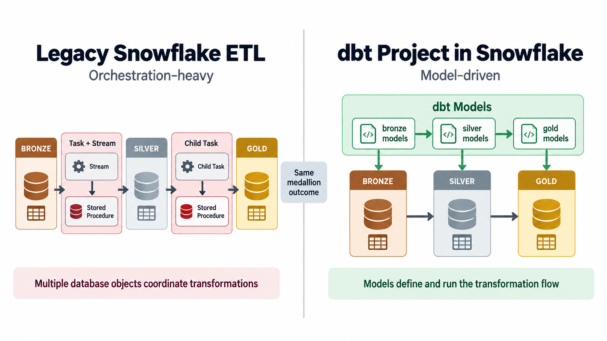
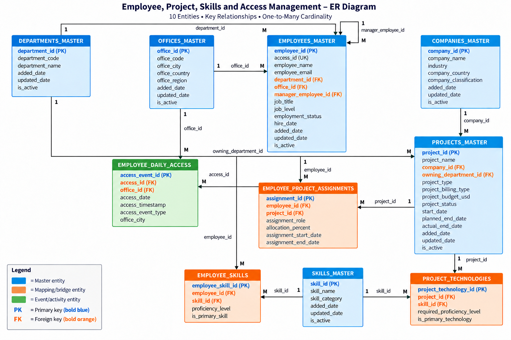

# dbt on Snowflake — HR Analytics

This workspace demonstrates how to migrate a legacy Snowflake stored-procedure-based ETL pipeline into a modern dbt project. It contains the complete legacy pipeline (stored procedures, streams, and tasks), the sample HR dataset, and the fully migrated dbt project -- all in one repo. Clone the repository and follow along step by step to run the legacy pipeline first, then build and compare the dbt equivalent side by side.

## Objective

Provide a hands-on, end-to-end reference for migrating a Snowflake medallion-architecture pipeline from stored procedures, streams, and tasks to a dbt project. By running both pipelines against the same dataset, you can compare the orchestration-heavy legacy approach with the model-driven dbt approach and understand the tradeoffs involved.

## Table of Contents

- [Legacy ETL Setup](#legacy-etl-setup)
- [GitHub Actions — Automated Deployment](#github-actions--automated-deployment)
- [Source Data — ER Diagram](#source-data--er-diagram)
- [dbt Project](#dbt-project)

---

## Legacy ETL Setup

The `legacy-etl-setup/` folder contains the original stored-procedure-based pipeline. Run these files in a Snowflake worksheet in the order listed below.

### 01-hr-analytics-deploy.sql

Creates the `HR_ANALYTICS` database with the full medallion architecture -- schemas, tables, stored procedures, streams, tasks, file formats, and an internal stage. After running this, you will have the complete database structure with all pipeline objects ready but no data loaded yet.

### 02-put_full_load.sql

Loads the base CSV files from `hr-analytics-data/full-data/` into the internal stage and runs COPY INTO to populate the Bronze tables. Then triggers the stored procedures that transform data through Silver and Gold layers. After running this, you will have a fully populated star schema with the initial dataset.

### 03-put_delta_load.sql

Loads daily incremental CSV files from `hr-analytics-data/daily-delta/` (day_01 through day_05) into the stage and processes each day sequentially through the pipeline. After running this, you will see how the SCD Type-2 dimensions track changes across multiple delta loads.

### 04-tear-down.sql

Suspends all tasks and drops the `HR_ANALYTICS` database along with all child objects. Use this to clean up when you are done exploring the legacy pipeline or before re-running the setup from scratch.

---

## GitHub Actions — Automated Deployment

A GitHub Actions workflow (`.github/workflows/deploy-legacy-etl.yml`) can deploy the legacy pipeline automatically using SnowSQL. It is triggered manually from the **Actions** tab.

### Setup

Add the following secrets in your repository under **Settings > Secrets and variables > Actions**:

| Secret | Description |
|---|---|
| `SNOWFLAKE_ACCOUNT` | Snowflake account identifier (e.g., `xy12345.us-east-1`) |
| `SNOWFLAKE_USER` | Snowflake username |
| `SNOWFLAKE_PASSWORD` | Snowflake password |
| `SNOWFLAKE_ROLE` | Role to use (e.g., `ACCOUNTADMIN` or `SYSADMIN`) |
| `SNOWFLAKE_WAREHOUSE` | Warehouse to use (e.g., `SANDBOX_WH`) |

### Running the Workflow

1. Go to the **Actions** tab in your GitHub repository.
2. Select **Deploy Legacy ETL Pipeline** from the left sidebar.
3. Click **Run workflow**.
4. Optionally check **Skip data load steps** to only deploy database objects without loading CSV data.

---

## Source Data — ER Diagram

The `hr-analytics-data/` folder contains synthetic HR data organized as 10 entities covering employees, projects, skills, and access management.

### Full Load (`hr-analytics-data/full-data/`)

Base dataset loaded once during initial setup.

| # | File | Description |
|---|---|---|
| 1 | `01_departments_master.csv` | Department hierarchy (codes, names, active status) |
| 2 | `02_offices_master.csv` | Office locations with city, country, and region |
| 3 | `03_companies_master.csv` | Client companies with industry and classification |
| 4 | `04_employees_master.csv` | Employee records with job title, level, department, and manager |
| 5 | `05_projects_master.csv` | Projects with budget, status, dates, and owning department |
| 6 | `06_employee_project_assignments.csv` | Staffing assignments with role and allocation percentage |
| 7 | `07_employee_daily_access.csv` | Badge in/out events per employee per office |
| 8 | `08_skills_master.csv` | Skill and technology catalog |
| 9 | `09_employee_skills.csv` | Employee-skill proficiency mapping |
| 10 | `10_project_technologies.csv` | Project technology requirements |

### Daily Deltas (`hr-analytics-data/daily-delta/`)

Incremental change files organized by day (day_01 through day_05). Each day contains only the entities that changed -- not all 10 files appear in every day. These deltas drive SCD Type-2 versioning in the Gold layer.

---

## dbt Project

The migrated dbt project lives in `dbt-workspace/`. See [`dbt-workspace/dbt-architecture.md`](dbt-workspace/dbt-architecture.md) for full architecture documentation including the design approach, model details, testing strategy, macros, and how to run the dbt pipeline.

### Quick Start with Snowsight

You can also upload the `dbt-workspace/` folder directly to a Snowsight workspace and start running dbt from the browser. Go to **Projects > Workspaces** in Snowsight, create a new workspace, upload the contents of `dbt-workspace/`, and run `dbt build` from the workspace terminal.
